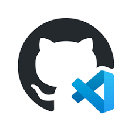

# Github TE Stack Template

This is a template for a full stack postgresql/java/vue project, with a lot of the boilerplate already set up,
and a lot of goodies included:


An SQL script to set up a postgres database, with authentication tables and an example todo table included.


A Server Application written in Java/Spring Boot configured to use the postgresql database, providing REST controllers for users and todos, and including the following Spring Boot libraries:

  - Spring Boot DevTools
  - Spring Boot Web
  - Spring Boot Data JPA/Postgres
  - Spring Boot Validation
  - Simple JWT auth provided by eu.fraho.spring


A client application written in Vue.js configured to connect to the SpringBoot server REST API to provide a basic login system and an example todo list page.  Vue is also configured to include the following libraries:
  - Vuex
  - Vue Router
  - Axios
  - Bootstrap Icons
  - Vuetify Components
  - Open Props



`.devcontainer` files are included to configure a CodeSpace environment to let you work on and run your project in the cloud right from your github repository.

## Starting your project from this template

For local development, you will need to have the following installed on your machine:
- Java 21
- Node.js 16
- Postgresql 13
- PGAdmin 4
- Visual Studio Code with the following plugins installed:
  - Java Extension Pack
  - Vue Official
  - Spring Initializr Java Support
  - SQLTools
  - SQLTools PostgreSQL/Cockroach Driver

To get started, clone this repository from your terminal:

```bash
git clone https://github.com/mlambert125/todo-list-fullstack
```

Next, to make this repository your own, delete the .git folder and reinitialize git:

```bash
cd todo-list-fullstack
rm -rf .git
git init
git add -A
git commit -m "Initial commit"
```

After this, you can rename the project folder to your project name:

```bash
cd ..
mv todo-list-fullstack YOUR_PROJECT_NAME
cd YOUR_PROJECT_NAME
```

Next, open a browser, navigate to your github account and create a new repository. Copy the url of the new repository, 
and add it as the origin of your local repository (replace YOUR_GITHUB_PROJECT_URL with the url of your new repository):

```bash
git remote add origin YOUR_GITHUB_PROJECT_URL
```

Finally, push to your remote repository:

```bash
git push -u origin master
```

From this point, you can start developing your project, and use your normal git workflow to push changes to your repository.

E.g.

```bash
git add -A
git commit -m "Your commit message here"
git push
```

Or use the integrated git tools in VSCode.


## Initial Setup

### Setting up the database

To set up the database, you will need to have Postgresql installed, and a database created. You can use PGAdmin to create a database.

Once the database is created, update the `server/src/main/resources/application.properties` file 
with the correct database connection information. (Specifically, change the end of the url to the name of your database)

Once you have created the database, you can use pgadmin or the integrated VS Code SQLTools to run the SQL script in the `database` folder to set up the tables.


## Running the project

This project includes a Spring Boot server and a Vue.js client.  You will need to run both to see the full application.


### Running the server

Open the project folder in Visual Studio Code.  On the left, at the bottom of the file explorer, you will see a
tab titled "Java Projects".  Click on this tab, and you will see the project listed.  Right click on the project
and select "Debug" to start the server with debugging enabled.

**Note:** If you do not see a project listed under "Java Projects", and instead see a button that says "Import Java Projects",
click on this button and wait a few for VSCode to discover your the server project, and then proceed. 

**Note:** If you would prefer, you can also open the project in IntelliJ IDEA and run the server from there.

Once the server is running, you should be able to navigate to `http://localhost:8080` in your browser and see that the server is running.

### Running the client

Open the terminal, and click the "+" button near the top right of the terminal window to open a new terminal.  In the new terminal,
run the following commands:

```bash
cd client
npm install
npm run dev
```

You should now be able to navigate to `http://localhost:5173` in your browser and see that the vue client application is running.


### Stop the server and client

To stop the server, click the red square in the floating run toolbar at the top of the window.

To stop the client, click `ctrl+c` in the terminal window where the client is running.

It doesn't matter which you stop first, but you should stop both before closing VSCode.


## Development

### Workflow

You can start the java application and the vue application using the instructions above in "Initial Setup."
From here, you can work on the server and client applications in the same way you would work on any other Spring Boot
or Vue.js application.

### Provided Authentication System

The provided authentication includes an authentication stack and user endpoints in the java application using the
`eu.fraho.spring library`, and a `UserController`.  The client application includes a login page and a routing system
that will redirect to the login page if the user is not authenticated.

### Provided API Service Module

The provided API service module in the client application includes methods to access the user and todo endpoints in the
java application.  You can use these methods as a template to create your own methods to access your own endpoints.

This can be found in the `client/src/server-api.js` file.

### Adding to the the data model

To change the data model to reflect your own application, you will need to add the following for each new table:

- Add the create/drop table SQL to the `database/create-script.sql` file
- Add a new model class to `server/src/main/java/Models` directory
  - The existing model classes use lombok annotations to generate getters/setters/constructors.  You can use these
    annotations for your model classes as well, or write the getters/setters/constructors yourself.
- Add a new DAO class to the `server/src/main/java/Daos` directory to provide data access methods
- Add a new controller class to the `server/src/main/java/Controllers` directory to provide REST endpoints for your new table
- Add methods to the client API service `client/src/server-api.js` to access your new REST endpoints
- Import the serverApi object into the appropriate Vue components and use your newly added methods to work with the data

### Customizing user records

User records are important to the authentication system, and are stored in the `users` table.  You can add additional
fields to the user table by adding fields to the `User` model class, and updating the `database/create-script.sql` file to 
reflect the changes.  This will not affect the authentication system, but will allow you to store additional information
about your users.

### Removing the todo table

If you do not need the todo table, you can remove the `Todo` model class, `TodoDao` class, and `TodoController` class
from the project, and then remove the todo table declaration and DROP from the `database/create-script.sql` file.

You should also remove the service calls for Todo from the client API service `client/src/server-api.js` file.
And finally, clear out the home page so that it does not display the todo list. 


#### Using Bootstrap Icons

The project is set up to use Bootstrap Icons.  You can see an example and links to documentation for this on the 
default about page.  

#### Using Vuetify Components

The project is set up to use Vuetify components.  You can see an example and links to documentation for this on the
default about page.

#### Using Open Props in your CSS

The project is set up to use Open Props in the client application.  You can see an example of this in the global css file
at `client/src/assets/main.css` and links to documentation for this on the default about page.

### GitHub CodeSpace

This project is set up to work with GitHub CodeSpace.  You can open the project in a CodeSpace by clicking the green
"Code" button at the top of the repository page, and selecting "Open with CodeSpace".  This will open the project in a
CodeSpace.

A benefit to using CodeSpace is that you do not need to have anything (VsCode, Java, Node.js, or Postgresql) installed 
on your local machine to work on the project.  In fact, you can work on the project and run and test it from any device 
with an modern web browser (e.g. an iPad.)  Everything you need is provided in the CodeSpace.  You also can can make 
ports public to share live access to your running application with others.

#### Creating the database in CodeSpace and updating configuration

You will need to connect the the local postgres database and run your script to create the database using the SqlTools 
extension in VSCode.  Since codespaces just includes the default postgres database without an easy way to create a new
database, you will need to connect to the database named `postgres` to run your initial creation script, and update the 
`application.properties` file in the `server/src/main/resources` folder with the correct database connection information.  
(Specifically, change the end of the url to postgres.)

#### Running the client and server in CodeSpace

You run these in the same way as you would on your local machine.  When each one runs, it will alert you that it has forwarded
a port to a public url.  You can click on this url to see the running application.

#### Making the ports truly public

By default, the forwarded ports are only accessible to you (logged in with your github credentials).  If you want to share 
the running application with others, you click on the ports tab in the terminal window, and then right-click the appropriate
port and choose "Change Port Visibility" and set it to public.  You can then share the url with others to let them see the
running application.
