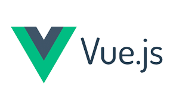

# Final Project Template 

This is a template for a full stack postgresql/java/vue project, with a lot of the boilerplate already set up,
and a lot of goodies included:


An SQL script to set up a postgres database, with authentication tables and an example todo table included.


A Server Application written in Java/Spring Boot configured to use a FinalProject database, providing REST controllers for users and todos, and including the following Spring Boot libraries:

  - Spring Boot DevTools
  - Spring Boot Web
  - Spring Boot Data JPA/Postgres
  - Spring Boot Validation
  - Simple JWT auth provided by eu.fraho.spring



A client application written in Vue.js configured to connect to the SpringBoot server REST API to provide a basic login system and an example todo list page.  Vue is also configured to include the following libraries:
  - Vuex
  - Vue Router
  - Axios
  - Bootstrap Icons
  - Vuetify Components
  - Open Props

## Initial Setup

### Setting up the database

To set up the database, you will need to have Postgresql installed, and a "FinalProject" database created. You can use PGAdmin to create the database.

Once you have created the database, you can use pgadmin or the integrated VS Code SQLTools to run the SQL script in the `database` folder to set up the tables.

## Running the project

This project includes a Spring Boot server and a Vue.js client.  You will need to run both to see the full application.

### Running the server

Open the server/POM.xml file in IntelliJ IDEA, and run the main application file.

Once the server is running, you should be able to navigate to `http://localhost:8080` in your browser and see that the server is running.

### Running the client

Open the client folder in VSCode, and open a terminal window in the client folder, and run the following commands:

```bash
npm install
npm run dev
```

You should now be able to navigate to `http://localhost:5173` in your browser and see that the vue client application is running.

## Development

### Workflow

You can start the java application and the vue application using the instructions above in "Initial Setup."
From here, you can work on the server and client applications in the same way you would work on any other Spring Boot
or Vue.js application.

### Provided Authentication System

The provided authentication includes an authentication stack and user endpoints in the java application using the
`eu.fraho.spring library`, and a `UserController`.  The client application includes a login page and a routing system
that will redirect to the login page if the user is not authenticated.

### Provided API Service Module

The provided API service module in the client application includes methods to access the user and todo endpoints in the
java application.  You can use these methods as a template to create your own methods to access your own endpoints.

This can be found in the `client/src/server-api.js` file.

### Adding to the the data model

To change the data model to reflect your own application, you will need to add the following for each new table:

- Add the create/drop table SQL to the `database/create-script.sql` file
- Add a new model class to `server/src/main/java/Models` directory
  - The existing model classes use lombok annotations to generate getters/setters/constructors.  You can use these
    annotations for your model classes as well, or write the getters/setters/constructors yourself.
- Add a new DAO class to the `server/src/main/java/Daos` directory to provide data access methods
- Add a new controller class to the `server/src/main/java/Controllers` directory to provide REST endpoints for your new table
- Add methods to the client API service `client/src/server-api.js` to access your new REST endpoints
- Import the serverApi object into the appropriate Vue components and use your newly added methods to work with the data

### Customizing user records

User records are important to the authentication system, and are stored in the `users` table.  You can add additional
fields to the user table by adding fields to the `User` model class, and updating the `database/create-script.sql` file to 
reflect the changes.  This will not affect the authentication system, but will allow you to store additional information
about your users.

### Removing the todo table

If you do not need the todo table, you can remove the `Todo` model class, `TodoDao` class, and `TodoController` class
from the project, and then remove the todo table declaration and DROP from the `database/create-script.sql` file.

You should also remove the service calls for Todo from the client API service `client/src/server-api.js` file.
And finally, clear out the home page so that it does not display the todo list. 

#### Using Bootstrap Icons

The project is set up to use Bootstrap Icons.  You can see an example and links to documentation for this on the 
default about page.  

#### Using Vuetify Components

The project is set up to use Vuetify components.  You can see an example and links to documentation for this on the
default about page.

#### Using Open Props in your CSS

The project is set up to use Open Props in the client application.  You can see an example of this in the global css file
at `client/src/assets/main.css` and links to documentation for this on the default about page.
